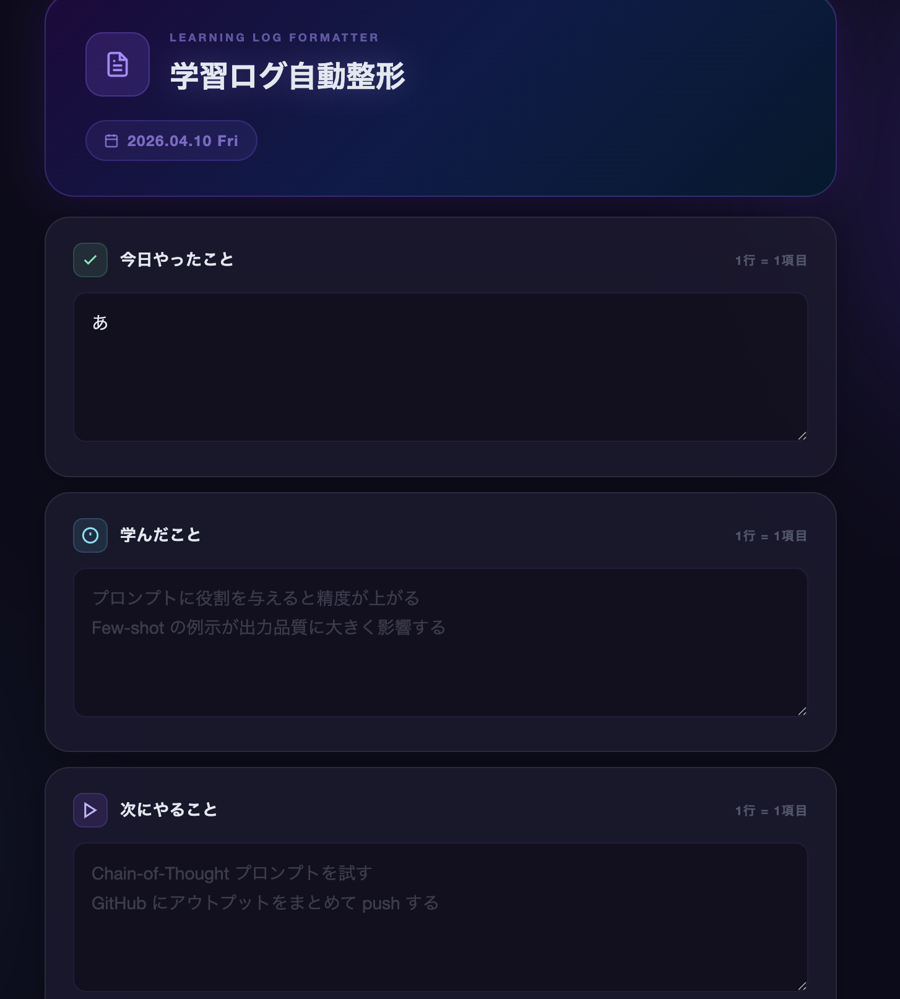
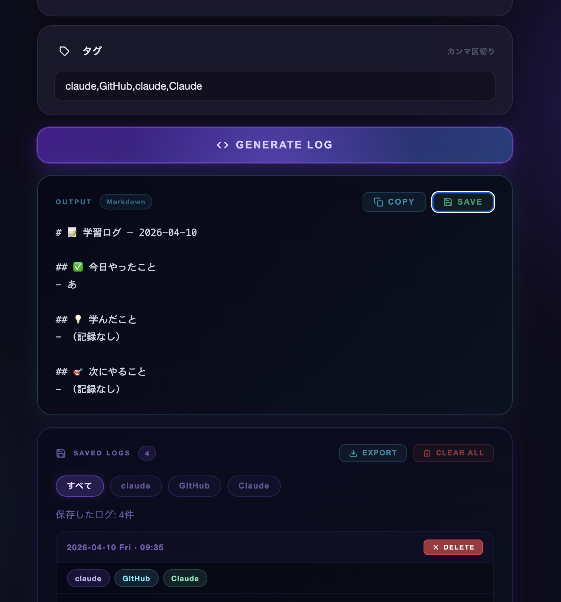

# claude-code-playground

AI学習初心者が、1日の学びを記録・整理するためのツールです。
「今日やったこと」「学んだこと」「次にやること」を入力すると、Markdown形式に整形して保存できます。

---

## 機能

- 学習ログを入力して、Markdown形式に自動整形する
- タグをつけてログを保存できる（例: GitHub, Claude Code）
- 保存したログをタグで絞り込んで見られる
- タグ入力欄に、過去に使ったタグの候補を表示する
- ログを1件ずつ削除、またはまとめて全削除できる
- 保存済みログをまとめてMarkdownファイルとして書き出せる（エクスポート機能）
- 入力欄がすべて空のときは保存できない（空ログの誤保存を防ぐ）
- 同じタグを複数入力しても、保存時に自動で重複を除く
- タグは保存時に小文字ベースで統一され、一部は表示時に見やすい表記へ変換される（例: github → GitHub）
- ページを再読み込みしても、保存した内容が消えない（localStorageを使用）

---

## スクリーンショット

**入力フォームと生成結果**

**保存済みログ一覧とエクスポート**

---

## ファイル構成

| ファイル | 内容 |
|---|---|
| `index.html` | 自己紹介ページ。NEXT MISSIONやレベル・ストリーク機能あり |
| `learning-log.html` | 学習ログツールのメインページ |
| `learning-log.css` | 学習ログツールのデザイン |
| `learning-log.js` | 学習ログツールの動き（保存・表示・タグ管理など） |
| `logs/` | 手動で書き出したMarkdownログの保管フォルダ（ツールによる自動保存はなし） |
| `prompts/daily-log-instructions.md` | 1日のまとめをGitHubとNotionに保存するための手順テンプレート |
| `prompts/session-start-check.md` | 作業開始時に現在地と状態を確認するためのテンプレート |

---

## 使い方

1. `learning-log.html` をブラウザで開く
2. 3つの入力欄に今日の学習内容を書く
3. タグ欄にカテゴリを入力する（カンマ区切りで複数OK）
4. **GENERATE LOG** を押すとMarkdownが生成される
5. **SAVE** を押すとブラウザに保存される
6. 下の「SAVED LOGS」欄で過去のログを確認・絞り込みできる
7. **EXPORT** を押すと、保存済みのログをまとめてMarkdownファイルとして書き出せる
